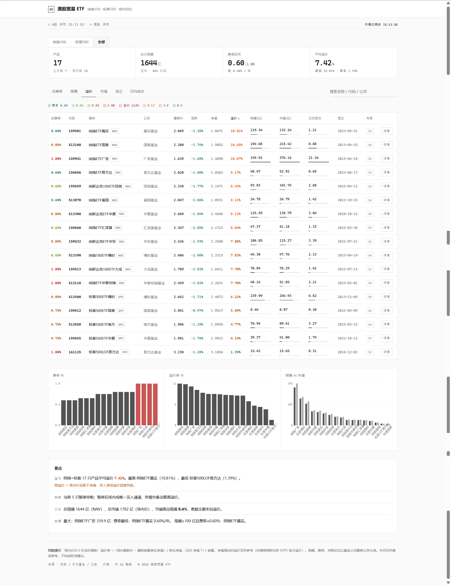

# 美股宽基 ETF 对比页

纳指100 / 标普500 场内 ETF 实时对比工具。极简线条风，无渐变无阴影，等宽数字，跟随系统亮/暗色。



## 功能

- **17 只 ETF**：纳指100（12只）+ 标普500（5只），顶部切换系列
- **实时行情**：最新价、涨跌、成交额，约 5 秒刷新
- **溢价率**：（场内最新价 − 快照净值）/ 快照净值，随价格实时重算
- **对比图表**：规模、费率、溢价率三张 SVG 柱状图
- **要点洞察**：高溢价、低费率、规模排名等自动提炼
- **详情弹层**：点行内「详情」查看完整指标，含东财 IOPV 官方溢价参考
- **红绿闪烁**：价格变化时单元格闪绿（涨）/红（跌），0.9s 渐隐
- **开闭市状态**：A股 / 美股实时判断

## 口径说明

- **溢价率** =（场内最新价 − 快照净值）/ 快照净值。快照净值固定，不随行情更新（与参考站一致）
- QDII 净值 T+1 披露，盘中溢价仅供参考
- 东财 IOPV 官方溢价（`f24` 字段）仅在详情弹层展示，不作主口径

## 部署

### Cloudflare（推荐）

```bash
# 1. 安装 wrangler
npm install -g wrangler

# 2. 登录
wrangler login

# 3. 部署 Worker（API 代理）
wrangler deploy

# 4. 部署 Pages（静态页）
wrangler pages project create us-etf
wrangler pages deploy . --project-name us-etf
```

部署后：
- 静态页：`https://<random>.us-etf.pages.dev`
- API 代理：`https://us-etf.<account>.workers.dev`

`_redirects` 已配置 `/api/*` → Worker，无需额外操作。

### 本地开发

```bash
python serve.py
# 浏览器打开 http://127.0.0.1:8937/
```

## 刷新内嵌快照

页面数据内嵌在 `index.html` 的 `EMBEDDED_DATA` 中。更新数据：

```bash
python serve.py          # 起本地代理
python refresh_embedded.py  # 拉最新行情+净值，写回快照
```

## 文件

| 文件 | 用途 |
|------|------|
| `index.html` | 主页面（数据 + 渲染 + 交互 + 样式，全内联） |
| `worker.js` | Cloudflare Worker：`/api/quote` 行情代理、`/api/nav` 净值代理 |
| `wrangler.toml` | Worker 配置 |
| `_redirects` | Pages 路由：`/api/*` → Worker |
| `serve.py` | 本地静态服务 + 东财代理（开发用） |
| `refresh_embedded.py` | 刷新内嵌快照数据 |

## 数据源

- 行情：东财 `push2delay.eastmoney.com`（实时价、涨跌、最高最低）
- 净值：东财 `api.fund.eastmoney.com/f10/lsjz`（QDII T+1）
- IOPV 溢价：东财 `push2` 的 `f24` 字段

## License

MIT